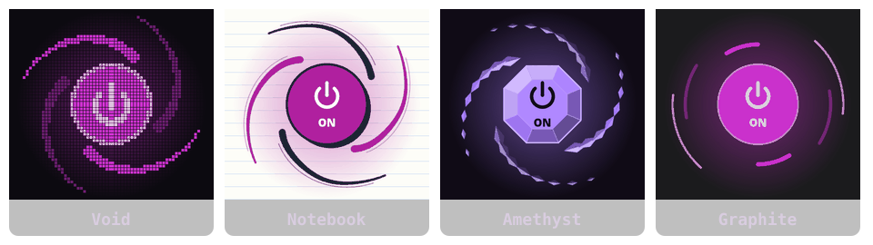
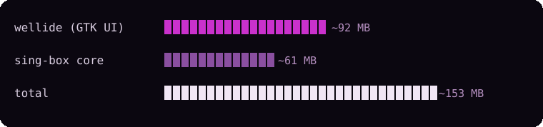

<p align="right"><b>English</b> · <a href="README.ru.md">Русский</a></p>

<p align="center"></p>

<p align="center">
  <b>A tiny VPN client on top of <a href="https://github.com/SagerNet/sing-box">sing-box</a>.</b><br>
  Written in C and GTK for Linux and Windows. Light on CPU, and it stops drawing entirely when hidden in the tray.
</p>

---

## Install

**Linux** (Arch, Debian 12+, Ubuntu 22.04+, Fedora, openSUSE, Alpine):

```sh
curl -fsSL https://raw.githubusercontent.com/Wellbou/wellide/main/install.sh | sh
```

The script installs the build dependencies and sing-box, builds Wellide, and grants TUN rights to a separate copy of the core. Wellide itself never runs as root. Flags: `sh -s -- --no-tun` skips the TUN step, `--uninstall` removes Wellide.

**Debian 12+ / Ubuntu 23.04+ / Mint 22+:** get `wellide_x.y.z_amd64.deb` from [Releases](https://github.com/Wellbou/wellide/releases) and install it with `sudo apt install ./wellide_*.deb`. sing-box is included; TUN rights are granted from Settings on first use.

**Windows 10/11:** get `wellide-x.y.z-setup.exe` from [Releases](https://github.com/Wellbou/wellide/releases). It already includes sing-box and wintun.

## The button

<p align="center"></p>

The vortex arms orbit the power button. When you click, they wrap onto it, the theme plays its switch effect, and the arms spring back out. The button shows the current state:

- **Connected:** the button is lit in the theme colour and the orbit glows.
- **Disconnected:** the button is dark and the arms are dimmed.
- **Connecting:** the arms stay wrapped around the button and spin.

## Features

- **Subscriptions and keys:** `https://` subscriptions (with traffic and expiry info), `vless:// vmess:// trojan:// ss:// hy2:// tuic://`. Leave the field empty to paste from the clipboard. `wellide://import/<url>` deep links also work.
- **Auto** picks the server with the lowest ping and re-checks it every 2 minutes. It skips servers in your own country, since those can't get past geo-blocks.
- **Automatic ping:** TCP connect time while offline, the real delay through the server once connected.
- **Modes:** TUN (all traffic), system proxy (KDE, GNOME, Windows), or local port only (`127.0.0.1:12400`, HTTP and SOCKS5).
- **Local sites go direct:** optional split routing for 🇷🇺 Russia, 🇮🇷 Iran and 🇨🇳 China, based on sing-geoip and sing-geosite rules.
- **Traffic graph** and a tray icon. The UI is in English and Russian, chosen from the system locale.

## Themes

<p align="center"></p>

Every theme has its own button look and switch effect:

| Theme | Button | Switch effect |
|---|---|---|
| **Void** (default) | pixel grid | a white star bursts, burns out from the centre and breaks into sparks |
| **Notebook** | ink strokes on ruled paper | the pen redraws the outline, ink splashes |
| **Amethyst** | a cut gem; the arms are strings of shards | the light sweeps once around the facets and the rim breaks into flying edges |
| **Graphite** | calm arcs | an accent arc sweeps around the rim |

### Custom themes

Put an `.ini` file into `~/.config/wellide/themes/` (on Windows, `%LOCALAPPDATA%\wellide\themes\`). The theme is applied as soon as you save the file. **Settings → Themes folder…** opens this folder.

```ini
[theme]
name=Midnight
base=void            ; inherit everything you don't set
button=pixel         ; pixel | sketch | crystal | dial
bg=#101018           ; window
bg2=#16161f          ; sidebar
card=#1d1d29
fg=#e8e8f0
fg-dim=#8a8aa0
accent=#7c4dff       ; buttons, active tab
accent-fg=#ffffff
line=#2a2a3a
danger=#ff5277
ink=#2a2240          ; second arm colour
glow=#7c4dff         ; lit button, arms, halo
pixel=true           ; square, stepped borders
ruled=false          ; notebook ruling
outline=false        ; ink outlines + offset shadows
radius=0

[css]
extra=.h1 { letter-spacing: 2px; }
file=midnight.css    ; any GTK3 CSS, loaded after the theme
```

## Performance

<p align="center"></p>

Measured on Arch with KDE, connected in TUN mode:

- **Memory:** the numbers above are RSS. Only about 17 MB of the UI's memory is its own; the rest is GTK libraries shared with other apps. Wellide never loads images through gdk-pixbuf (which spawns sandboxed helper processes on newer distros): every icon and switch is drawn with cairo.
- **Idle CPU:** usually 1–3 % with the window open. Measurements were noisy, and single runs sometimes showed 6–15 %.
- **Hidden in the tray:** the button and graph stop drawing.
- **How the button stays cheap:** the idle orbit redraws at 20 fps, and the arms are a cached image that is rotated rather than redrawn.
- **Animations off:** CPU drops to zero.

## Command line

```
wellide [--hidden] [--import URL] [--connect|--disconnect|--toggle] [--status] [--quit]
```

When Wellide is already running, the command goes to the running instance, so you can use these in scripts and hotkeys.

## Build

```sh
# deps: gtk3 json-glib libsoup3 (+ libayatana-appindicator for the tray)
make && sudo make install

# README art: animation frames come from the app's own renderer
make tools/render
tools/render void /tmp/frames 320 25 && tools/render --stills /tmp/stills
WL_FRAMES=/tmp/frames WL_STILLS=/tmp/stills python3 tools/art.py
```

The Windows build runs in GitHub Actions: MSYS2 UCRT64 for the app, NSIS for the installer. See `.github/workflows/build.yml`.

## License

[GPL-3.0-or-later](LICENSE). You may use, study, share and modify Wellide, but any distributed version — including forks and rebrands — must stay open source under the same licence.
