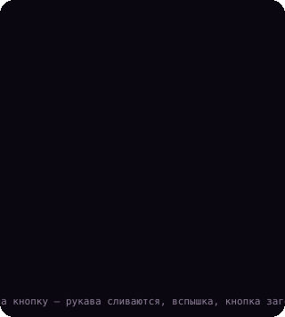
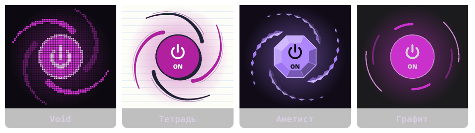

<p align="right"><a href="README.md">English</a> · <b>Русский</b></p>

<p align="center"></p>

<p align="center">
  <b>Лёгкий VPN-клиент на <a href="https://github.com/SagerNet/sing-box">sing-box</a>.</b><br>
  Написан на C и GTK для Linux и Windows. Почти не нагружает процессор, а свёрнутый в трей вообще ничего не рисует.
</p>

---

## Установка

**Linux** (Arch, Debian 12+, Ubuntu 22.04+, Fedora, openSUSE, Alpine):

```sh
curl -fsSL https://raw.githubusercontent.com/Wellbou/wellide/main/install.sh | sh
```

Скрипт ставит зависимости для сборки и sing-box, собирает Wellide и выдаёт права для TUN отдельной копии ядра. Сам Wellide никогда не работает от root. Флаги: `sh -s -- --no-tun` пропускает шаг с TUN, `--uninstall` удаляет Wellide.

**Windows 10/11:** скачайте `wellide-x.y.z-setup.exe` из [Releases](https://github.com/Wellbou/wellide/releases). sing-box и wintun уже внутри.

## Кнопка

<p align="center"></p>

Вокруг кнопки питания кружатся рукава вихря. При нажатии они скручиваются на кнопку, тема проигрывает свой эффект переключения, и рукава разлетаются обратно. Кнопка показывает текущее состояние:

- **Подключено:** кнопка горит цветом темы, орбита светится.
- **Отключено:** кнопка тёмная, рукава приглушены.
- **Подключение:** рукава обмотаны вокруг кнопки и крутятся.

## Возможности

- **Подписки и ключи:** подписки `https://` (с остатком трафика и сроком), ключи `vless:// vmess:// trojan:// ss:// hy2:// tuic://`. Если оставить поле пустым, ссылка берётся из буфера обмена. Работают и ссылки вида `wellide://import/<url>`.
- **«Авто»** выбирает сервер с лучшим пингом и перепроверяет его каждые 2 минуты. Серверы в вашей стране пропускаются: они не помогают обойти гео-блокировки.
- **Пинг обновляется сам:** без подключения это время TCP-соединения, с подключением — реальная задержка через сервер.
- **Режимы:** TUN (весь трафик), системный прокси (KDE, GNOME, Windows) или только локальный порт (`127.0.0.1:12400`, HTTP и SOCKS5).
- **Сайты своей страны напрямую:** можно включить для 🇷🇺 России, 🇮🇷 Ирана и 🇨🇳 Китая, по правилам sing-geoip и sing-geosite.
- **График трафика** и значок в трее. Интерфейс на русском и английском, язык берётся из системы.

## Темы

<p align="center"></p>

У каждой темы своя кнопка и свой эффект переключения:

| Тема | Кнопка | Эффект переключения |
|---|---|---|
| **Void** (по умолчанию) | пиксельная сетка | вспыхивает белая звезда, выгорает от центра и рассыпается на искры |
| **Тетрадь** | штрихи чернилами на листе в линейку | ручка обводит кнопку заново, летят брызги чернил |
| **Аметист** | огранённый камень, рукава — цепочки осколков | свет обходит грани по кругу, а обод раскалывается на разлетающиеся рёбра |
| **Графит** | спокойные дуги | по ободу пробегает дуга цвета темы |

### Свои темы

Положите `.ini`-файл в `~/.config/wellide/themes/` (в Windows — `%LOCALAPPDATA%\wellide\themes\`). Тема применяется сразу после сохранения файла. **Настройки → Папка тем…** открывает эту папку.

```ini
[theme]
name=Полночь
base=void            ; всё, что не задано, берётся из базовой темы
button=pixel         ; pixel | sketch | crystal | dial
bg=#101018           ; окно
bg2=#16161f          ; боковая панель
card=#1d1d29
fg=#e8e8f0
fg-dim=#8a8aa0
accent=#7c4dff       ; кнопки, активная вкладка
accent-fg=#ffffff
line=#2a2a3a
danger=#ff5277
ink=#2a2240          ; второй цвет рукавов
glow=#7c4dff         ; горящая кнопка, рукава, ореол
pixel=true           ; квадратные ступенчатые рамки
ruled=false          ; тетрадная линовка
outline=false        ; чернильные обводки и тени
radius=0

[css]
extra=.h1 { letter-spacing: 2px; }
file=midnight.css    ; любой GTK3 CSS, подключается после темы
```

## Производительность

<p align="center"></p>

Замеры на Arch с KDE, подключение через TUN:

- **Память:** на графике — RSS. Собственной памяти у интерфейса около 17 МБ, остальное — библиотеки GTK, общие с другими программами. Wellide не загружает картинки через gdk-pixbuf (на новых дистрибутивах он запускает отдельные процессы-песочницы): все иконки и переключатели рисуются через cairo.
- **Процессор в простое:** обычно 1–3 % с открытым окном. Замеры шумные, отдельные прогоны доходили до 6–15 %.
- **В трее:** кнопка и график перестают рисоваться.
- **Почему кнопка дешёвая:** в покое орбита перерисовывается 20 раз в секунду, а рукава — это готовая картинка, которую поворачивают, а не рисуют заново.
- **С выключенными анимациями** нагрузка падает до нуля.

## Командная строка

```
wellide [--hidden] [--import URL] [--connect|--disconnect|--toggle] [--status] [--quit]
```

Если Wellide уже запущен, команда уходит в работающее окно. Удобно для скриптов и горячих клавиш.

## Сборка

```sh
# зависимости: gtk3 json-glib libsoup3 (+ libayatana-appindicator для трея)
make && sudo make install

# картинки для README: кадры анимации рисует рендерер самой программы
make tools/render
tools/render void /tmp/frames 320 25 && tools/render --stills /tmp/stills
WL_FRAMES=/tmp/frames WL_STILLS=/tmp/stills python3 tools/art.py
```

Сборка под Windows идёт в GitHub Actions: MSYS2 UCRT64 для программы, NSIS для установщика. Смотрите `.github/workflows/build.yml`.

## Лицензия

[GPL-3.0-or-later](LICENSE). Wellide можно использовать, изучать, распространять и изменять, но любая распространяемая версия — в том числе форки и ребрендинги — должна оставаться открытой под той же лицензией.
